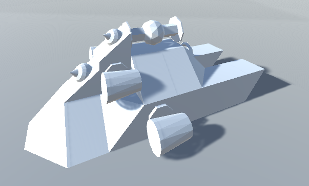

# BotMender

A TPS Unity game where bots can be built from blocks and then taken into (PvP) action.
The current version is an early prototype and is continuously being updated.
There is no playable build, the project has to be imported into Unity to run it.

Here's an example image of a bot: *(authentic programmer graphics)*  

## Blocks, building, systems

Each blocks has mass, health and "connect-sides": sides on which it can connect to other blocks.
The block placement system is expected to get reworked a bit due to only allowing
blocks which take a whole block unit of space.

All blocks may also define a system: if the block is placed, the system gets installed onto the bot.
There are 3 kinds of system: propulsion, weapon and active.
An active system usually gives some sort of special ability which has a cooldown.
Passive systems might get introduced in the future.

## Bots

A bot is a collection of its parts (blocks), and systems.
Since the systems are defined by the blocks, a bot can be serialized just by serializing its blocks.
The health of a bot is the sum of its blocks' health.

# Current state

This project is currently an early prototype.
Nothing is final, and everything which has been implemented is subject to improvement.
The current goal is to implement a basic version of as many of the features as possible.
This allows design errors to be spotted early on
before any radical would be required when fixing them.
This also means that all front-end development is kept to a bare minimum.
At the moment the short-term goal is to make the already implemented features
smoothly work in a networked environment.

# Contributing

If you are thinking of contributing, feel free to do so, no need to be shy!
As outlined in the previous paragraph, the main focus is back-end development for the moment,
but don't let that discourage you if that's not your thing.
If you would like to ask for guidelines as to how you could contribute,
you should contact [Trigary](https://github.com/Trigary).
The [codebase documentation](code-docs.md) contains a collection of information useful
when interacting with the programming-related side of this project.

# Codebase

Verbose naming and lots of documentation should make the codebase easy to read.
Unfortunately it's not always enough and that's what this section hopes to aid.

## Networking

An open-source library made by [Trigary](https://github.com/Trigary) named
[DoubleSocket](https://github.com/Trigary/DoubleSocket) is used to handle the networking.
This allows the bypassing of Unity's limited and poorly documented HLAPI and LLAPI.
The library uses a synchronized TCP and UDP socket for each party,
therefore taking advantage of TCP's flow and congestion control while also allowing
UDP packets to be used when reliability and ordered packets are not required.

## Adding new blocks, systems

All instructions about how to register blocks, systems can be
found in the `BlockFactory` and `SystemFactory` classes.
